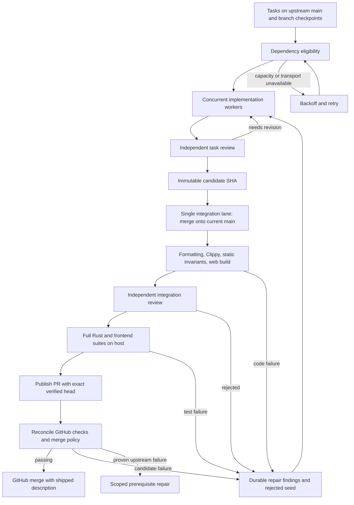

# Development loop audit

2026-10-08. Scope: the development controller, sandbox driver, remote worker,
agent rounds and prompts, deterministic checks, host test gate, promotion,
cockpit reporting, and their local regression tests. This audits the shell
and Python development machinery, not Gyre's Rust product runtime.

## Verdict

The basic shape is reasonable: a durable task ledger, independent implementation
workers, immutable candidate commits, independent review, and promotion of an
exact checked merge. It can ship upstream commits. The previous failure path,
however, was not a convergent implementation loop: a failed checker stopped
the task, and an explicit retry could check the same broken commit again.
Increasing slots amplified wasted work without fixing that feedback gap.

The follow-up implements requirement generations, durable launch recovery,
owned resource inventory, asynchronous cleanup, baseline classification,
backpressure and bounded fidelity discovery. These paths have local regression
coverage. Their cloud behavior and model judgment still need live validation.
Compilation, lint, tests, and agent review provide evidence; none alone proves
spec fidelity.

The controller should remain small. A new orchestration framework is not
needed to repair these issues. Strengthen its state and execution contracts,
then measure successful upstream delivery before expanding the abstraction.

## What actually runs



`dev-controller.py` imports upstream tasks into SQLite WAL, orders eligible
tasks, and launches `dev-sandbox.sh`. The driver creates and stages an
OpenShell sandbox. `dev-remote.sh` clones or resumes a checkout and runs up
to six agent rounds, checkpointing and pushing after each round. Clone and
transport retries reuse the sandbox. Implementation and review use separate
OMP sessions; all roles currently pin GLM 5.3.

A checker creates a two-parent merge onto an explicit base, runs
`dev-check.sh`, and requests a separate integration review. Its verified ref
identifies the merge commit. The controller validates the base and candidate
ancestry, runs the full Rust and frontend suites on that exact tree locally,
and publishes a PR, reconciles GitHub checks, then requests a GitHub merge with
an exact-head guard and no administrator bypass. A moving upstream base causes
rechecking. The merge message includes the task, spec, candidate, and shipped
behavior from the task file (`dev-merge-message.py`).

The host test lane matters: the current sandbox environment cannot run tests
requiring loopback listeners. Clippy compiles all Rust targets in the cloud;
the actual full suites run on the host before promotion. This host is a
delivery dependency and a throughput bottleneck.

## Evidence from the running ledger

At one read-only observation during this audit, the ledger contained:

| State | Tasks |
|---|---:|
| Running | 42 |
| Candidate | 1 |
| Failed | 3 |
| Ready | 98 |
| Marked merged | 65 |

Only **one** `merged <SHA>` event was recorded by this controller. The 65
figure includes tasks imported as already complete on upstream `main`.
It is not evidence of 65 controller deliveries. The three latest failed
checkers were task-072, task-093, and task-097, all with exit 1. These are
gate failures, not just provisioning failures. The previously inspected
task-072 log contained concrete Clippy findings, including `unnecessary_map_or`
and `double_must_use`; those findings were not routed back to implementation.

All 209 ledger tasks referenced existing dependency tasks at this observation.
That does not establish an acyclic graph or correct dependency decomposition.
The parser also truncated multiline dependency lists to their first item:
30 task files have affected lists, including task-114's dependency on task-208.
This permitted premature implementation even when omitted prerequisites were
unfinished. The repair restores every listed dependency on the next sync.
A separate scan using the repaired parser found 163 dependency edges and no
cycles across the 209 local task files.
The coverage summary was last updated October 5 and reported 46% coverage.
Coverage is maintained Markdown; a task merge does not mechanically establish
that a section's claimed status is true or refresh the coverage audit.

These are point-in-time observations of a running system. No live task or
sandbox was changed as part of this audit, and no new live merge was verified.

## Findings and focused repairs

### Multiline dependencies were silently discarded — critical, repaired

`field()` used `\s*` after the field name. That consumed the newline after
`depends_on:` and returned the first list item as a scalar. `deps()` therefore
never read the rest of the list. Scheduling's set-containment check was
correct for the truncated data, but incorrect for the task's actual contract.

Scalar parsing now consumes horizontal whitespace only, and the list parser
reads all dependency items. A Git-backed scheduling test proves that merging
the first prerequisite does not admit a task whose second prerequisite remains
unfinished. Promotion also rechecks dependencies, so an old in-flight checker
cannot bypass the repaired scheduler; it releases the integration lane for
its unfinished prerequisites. This explains part of why high worker activity could coexist with
poor integration results. It does not establish the cause of every failure.

### 1. Failed verification did not drive implementation — critical, repaired

Previously, `reap()` moved any failed checker to `failed`. A host suite failure
did the same in `promote()`. `retry_failed_task()` selected a completed seed as
a candidate, so pressing Retry could rerun verification without editing code.

Code failures now create a durable `repair.md` containing the candidate/base
SHAs, attempt ID, and the last 64 KiB of the failure log. The rejected candidate
becomes the next worker's seed. Its task is reopened as `needs-revision`, and
both implementation and review receive the findings. Sync cannot rediscover
the rejected legacy candidate and bypass repair. Three repair cycles are
allowed; repeated failures then require attention. An explicit retry retains
the findings and grants a fresh budget.

Startup migrates identifiable old checker and host-suite failures into this
path. Unknown driver exits, missing host processes, configuration errors,
and exhausted bootstrap/push retries are not automatically treated as code
defects. Model timeouts and other operational outcomes still need better
typed classification; the repair loop is not a universal retry policy.

### 2. Concurrent final checks invalidated each other — high, repaired

Previously, many checkers could build against the same `main` base. The first
merge advanced main, invalidating the other integrations and requiring new
sandboxes and repeated full verification. Workers could also occupy every
slot while ready candidates waited.

Implementation remains concurrent. Final integration is now one lane,
including the host gate and upstream promotion. Candidates have priority,
and one admitted slot is reserved for integration when capacity exceeds one.
Older in-flight host gates also prevent starting another host gate. One slot
alternates between implementation and integration.

This improves useful throughput but does not remove the serial bottleneck.
Fifty desired slots permit up to 49 implementation workers plus integration;
they do not permit 50 independent safe promotions onto one moving main branch.
A future speculative merge queue needs a validated chain of bases, not
independent checks against the same base.

### 3. A candidate could weaken the verifier judging it — high, partially repaired

Formatting and Clippy helpers were staged by the driver, but most static
checks ran from the candidate's checkout. Changing a check to always pass,
or changing its exemptions, could weaken the gate.

Integration now runs upstream static scripts against candidate code, restores
the candidate scripts, then runs those too. Script locations are preserved
because some checks derive the repository root from their location. New
exemption entries are rejected by identity, including replacements that keep
the entry count unchanged. Restoration is trapped on failure so the reviewer
sees the original merge tree.

This protects existing static gates from accidental weakening. It does not
make the entire build or test system independent of the candidate: build
configuration, test bodies, fixture behavior, and product code remain editable.
The independent reviewer must reject meaningless tests and omitted behavior.
Agent sandbox access is broad; this is not a security boundary against a
deliberately hostile agent.

### 4. Completion could bypass a successful task review — high, repaired in new workers

The worker previously stopped on `progress: complete`, regardless of the
round's exit code or which role set it. A failed implementation round could
leave that frontmatter behind and be nominated as a candidate.

New workers require a successful review round before honoring completion.
Completed seeds receive a fresh review; rejected seeds return to implementation.
This is workflow evidence, not a cryptographic attestation or independent proof
of correctness. Imported old candidates still undergo integration review and
the full verification pipeline.

### 5. Source outages could strand outcomes and suppress cleanup — high, repaired

The controller marked a worker attempt finished before fetching its checkpoint.
If that fetch failed, the task could remain running with no running attempt
left to consume. A failed sync also skipped the cleanup pass altogether.

Checkpoint refresh now happens before consuming the worker outcome. Cleanup
and host-process observation run independently of source sync. A durable exit
record makes a sandbox eligible for cleanup even if its Git outcome cannot
yet be consumed. Failed upstream pushes retain the verified merge instead
of automatically spending another checker sandbox on an unchanged tree.
An invalid verified ref blocks its task rather than killing the entire controller.

### 6. Cockpit counters confused imported state with delivery — high, repaired reporting

The cockpit now distinguishes upstream-complete tasks from recorded controller
shipments, and shows when integration findings are awaiting repair. Provider
availability, Ready observations, and slot admission describe infrastructure;
they do not prove code quality or convergence. The coverage display remains
prominent, but its input is the repository's coverage claims.

## Follow-up implementation

| Audit finding | Implemented behavior |
|---|---|
| Changed requirements | Hash task requirements, referenced specs and GOAL; retain desired/observed/candidate generations; reopen stale completion and reject stale candidates. Progress, commit attribution and shipped summaries do not change the requirement generation. |
| Discovery and fidelity | Once runnable implementation work drains, propose at most two scoped audit tasks, four sections each. Independently review actual production entry points and replay acceptance probes. Correct hollow coverage claims and reopen or create implementation tasks. Audit completion is counted separately from product delivery. |
| Crash windows | Commit launch intent before starting worker, checker, host or gateway processes. Publish PID/start-time/boot identity before child cloud operations; adopt launches on restart; fail closed on uncertain identity. |
| Resource accounting | Reconcile a complete owned gateway inventory. Charge running/provisioning objects, launch reservations, orphans and deletion debt. A successful delete request frees no slot until inventory confirms absence. Stale or incomplete inventory pauses admission. |
| Slow cleanup/authentication | Run at most four durable deletion jobs asynchronously, with bounded authentication locks, CLI deadlines and exponential retry. Git source outages do not stop cleanup. |
| Autoscaler delays | If create times out but the named sandbox exists, keep polling the same object with increasing delay, an overall deadline and visible Pending phase. Clone, staging and push retry inside that object. |
| Broken main/environment | Reproduce a failed cloud gate on the main base in the same sandbox; run the same full host suites on the checked main base when a candidate fails. Cache by main SHA, environment and tool versions. A proven baseline defect proposes one scoped prerequisite task. Host infrastructure outages retry the verified tree locally with backoff; they consume no code-repair budget or new sandbox. |
| Integration backlog | Reserve integration capacity, serialize integration, cap candidate backlog (default eight), and report deliveries/hour, queue age, gate success and automatic repairs. |
| Mutable driver bundle | Freeze and hash scripts, prompts, model configuration and policy at launch. Persist the pinned model/image and bundle digest with the attempt. |
| Dependencies/write conflicts | Diagnose missing dependencies and cycles. Auditor scopes lease their matrix and referenced task files; reserve new task IDs durably. Ordinary production work remains concurrent, with conflict detection/rebase at integration. |
| Reporting | Show remote resource charge, deletion debt, inventory errors, attempt phases, observed generation, blocked baseline repairs and reviewable PRs in the cockpit. |
| Evidence/compaction | Keep bounded repair findings and per-generation fidelity JSON records with real production entry points and replayable probes. Prompts explain the contract; scripts enforce record shape, scope and probe outcomes. |

Publication now creates an idempotent GitHub PR for the verified integration
ref **after** independent cloud review and host suites pass. Its body describes
shipped behavior, exact head/base SHAs, gate results and the frozen bundle.
GitHub must confirm the exact head and expected base before publication is
accepted. Both modes reconcile GitHub checks on that exact head. Default mode
requests a GitHub merge with the shipped description and an exact-head guard;
`--publication pr` leaves passing PRs open. Required checks and merge policy
are enforced without an administrator bypass. The current upstream also
requires the PR to be up to date with main. Returning to default mode resumes
promotion with the normal base/generation checks. Publication failures retain the verification
and back off. PR URLs are immediately available in the cockpit ledger.

### Practical limits still requiring observation

- Live end-to-end delivery is being verified. The original restricted session
  prepared a commit bundle; Git write and network access are now available.
- The installed CLI confirms labels, JSON output and pagination options.
  The live gateway returned a complete 57-object inventory. TLS diagnostics
  precede its JSON on stdout; the parser now handles that prefix while rejecting
  malformed or truncated documents. Deletion acknowledgement/absence and full
  delivery recovery still require live observation. Unknown or apparently
  truncated inventory fails closed.
- Ownership labels identify new orphans. Unlabelled old sandboxes absent from
  the ledger need explicit ownership confirmation before removal. Cleanup
  cannot complete during a gateway outage; the cockpit reports the debt.
- Fidelity judgments remain model judgments. Mechanical evidence gates reject
  missing or failing probes, but they cannot establish that an assertion proves
  every semantic requirement. Follow-up tasks undergo independent review and
  the ordinary integration gates.
- Resource leases cover metadata auditors' demonstrated shared files. Normal
  implementation write sets are discovered through Git integration; speculative
  parallel merge lanes are deliberately not introduced.

## Quality and convergence contract

A delivered task should identify its desired spec/task generation, production
diff, reviewed acceptance evidence, gate outcomes, and upstream merge SHA.
Distinguish these results in state:

- Infrastructure unavailable: wait and retry with backoff, without spending a
  code repair budget.
- Candidate defect: preserve the candidate, send concrete findings to repair,
  and independently re-review changed code.
- Main baseline defect: block promotion and schedule a scoped prerequisite fix.
- Upstream push unavailable: preserve the verified merge and retry publication,
  checking whether the prior push actually succeeded.
- Delivered: upstream contains the verified tree; the corresponding spec
  generation has been observed and its acceptance evidence retained.

Meaningful operating metrics are deliveries/hour, candidate-to-merge latency,
first-pass gate success, repair convergence, stale-candidate age, time spent
waiting for dependencies/infra, and deletion-pending sandbox count. Agent
activity, successful provisioning, task completion claims, and coverage
percentage are not substitutes for these measurements.

## Validation and deployment

The local Python suite exercises controller restart outcomes, capacity
backoff, provider gating, candidate repair and budgets, integration
serialization, exact merge publication to a bare Git upstream, host gate
failure, sandbox recovery/deletion, provider configuration, and merge messages.
New gate tests execute the actual runner and show that weakening an upstream
check or replacing a frozen exemption cannot produce a passing integration.
These tests are included in CI, along with the stream relay test. Follow-up
fixtures cover generations, launch intent, ownership inventory, deletion debt,
retained pending sandboxes, baseline classification, bounded auditing, evidence
validation, candidate backpressure and idempotent PR publication.

Local results: 96 Python tests and all four cockpit/stream Node tests passed; shell syntax, cockpit JavaScript syntax,
and `git diff --check` passed. The Node relay test now passes with network/filesystem restrictions removed,
including text, incremental tool output, prompt/thinking omission and verdict
assertions. The earlier restricted session had rejected nested Node execution
with `EPERM`.
Tooling CI on `cd1c5f04` passed. A real model worker produced task-200 candidate
`0ad98e85`, cloud review/checks and exact-tree host suites passed, and the
controller published [PR #632](https://github.com/jsell-rh/gyre/pull/632).
Its GitHub CI passed except E2E: the same 37 failed tests also fail on its
exact upstream base `cd1c5f04`. This exposed the missing GitHub reconciliation
step; publication alone was insufficient evidence of delivery. The new CI
observer was exercised against those actual runs and classified the base
failure. A passing PR and completed merge remain to be observed.

Live follow-up on October 9 also exposed a worker recovery defect: a timed-out
baseline probe had left implementation changes in a Git stash. The first
recovery was performed manually and recorded in the attempt artifacts. Workers
now restore their owned baseline stashes before checkpointing; if restoration
conflicts, recovery archives every stash patch, including binary and untracked
files, locally before sandbox deletion. A real Git regression exercises that
conflict and applies the archived patch to a fresh checkout. The exhausted
first task-210 sandbox was deleted, and its next attempt resumed the published
checkpoint in a new sandbox.

This acceptance run is assisted: root supplied two independent UI regressions,
focused repair findings, stash recovery, and a runtime handoff when a reviewer
attempted server/browser verification inside a sandbox that forbids loopback
listeners. A draft host preview passed all 64 unchanged E2E tests; it is not
proof for the final candidate. The final exact-head GitHub checks and merge
remain the delivery criteria. Resumed review prompts now preserve the review
role and direct server/browser verification to the host and GitHub.

An additional main CI failure had 1,547 passing assertions but an unhandled
canvas exception: FlowRenderer's fixture lacked the real renderer's drawing
methods. Commit `4738c688` completes that fixture and makes the playback test
wait for an actual frame; the old fixture fails this probe, and the repaired
full frontend suite passes. No test assertions or gates were weakened.

Task-210's first integration check rejected Rust formatting and trailing
whitespace in the controller-generated CI transcript. The failure was routed
automatically to a new implementation attempt with the rejected candidate as
its seed. Generated prerequisite tasks now retain a bounded failure summary
instead of the full CI transcript; raw logs remain local. These diagnostic
observations are excluded from the generated task's requirement hash, so
cleaning up its log does not invalidate the reviewed production requirement.
A guarded migration preserves active candidates and leases only when the
old hash matches the unchanged requirement; a real requirement edit is not
silently relabeled. The regression also applies Git's actual whitespace gate
to the generated task.

Normal commit hooks also ran. `response-consumption` and `dead-components`
failed on untouched Rust CLI/server and product Svelte files. Both checks were
rerun on an isolated checkout of the unchanged base `51636f238873d7bbce317ac7a78a3642ed52c237`
and failed there too. The isolated tooling commit skips only these two confirmed
baseline hook failures; it does not change their scripts, exemptions, CI or
feature delivery gates. All other applicable commit hooks pass. These baseline
product defects are not repaired by this tooling change.

The Git delivery fixture supplies deterministic checker and host outcomes.
The GitHub API fixture is also synthetic. These fixtures prove local orchestration
and exact-SHA publication, not model competence,
production behavior, or remote gateway operation. A live acceptance run still
needs a real task, real model calls, real sandbox checks and host suites, and
confirmation that GitHub contains the merge and its shipped description.

The original loop fixes were committed and pushed. Running controllers
and already staged sandboxes do not automatically reload them. Preserve the
ledger and let existing attempt processes be adopted on restart:

```bash
source .gyre-dev-controller/gateway.env
pkill -TERM -f '[d]ev-controller\.py run'
uv run python scripts/dev-controller.py run --slots 50 --launch-burst 4
```

The existing slots file remains authoritative. Set it to `0` before a restart
if you want to observe recovery without dispatching new workers. Restore the
desired slot count after inspecting the ledger. Do not remove the ledger,
checkpoint refs, or attempt logs to resolve a controller lock error.

### Follow-up: review scope and queued navigation contract

A live task-210 review timed out after reconstructing rebased commit history.
Subsequent reviews now receive the mechanically computed merge base with
current upstream main and a diff summary. The failed-main SHA is diagnostic
provenance, not the task review range; inherited upstream changes are excluded.
Independent behavioral findings still require investigation and a verdict.
The current attempt retains its frozen runtime bundle, so this change applies
to future bundles rather than silently changing a running review.

Queued task-083 still instructed agents to restore the historical HSI sidebar,
even though canonical ui-navigation explicitly supersedes HSI navigation.
Commit acd20917 binds it to current scope routing and canonical navigation,
retaining its dependency and unfinished status. The coverage matrix records
the supersedure without increasing verified production coverage. Sync observed
the changed task contract and invalidated its previous generation.

The cockpit now labels its count “Dependency-eligible”: main-baseline repairs
can hold dispatch even when task dependencies are satisfied. The controller
was confirmed alive with one running repair worker when the count showed 59.
Commit c37c349d implements the scope and label changes; shell/JavaScript syntax
checks and all four existing cockpit/stream tests pass.

### Follow-up: shared Cargo target could invalidate exact-tree proof

An independent real Cargo fixture demonstrated a critical cache collision:
two worktrees with the same package identity shared a target directory. After
the good implementation passed, a broken implementation returned success
without compiling and replayed the good source's warning. The same broken
implementation failed with exit 101 in an isolated target. Thus a passing
shared-target run did not establish which checkout was tested.

The host gate now runs dev-cargo-clean.py before the Rust suite: Cargo metadata
selects workspace packages, and cargo clean removes those packages' artifacts
while retaining third-party caches. Host proof records carry an artifact-policy
version; older success markers are rejected and rechecked. Baseline cache
fingerprints include that policy. Isolated review and implementation worktrees
are instructed to use independent target directories. The new regression uses
real Cargo to require good/pass, mutant/fail, good/pass and checks that unrelated
dependency artifacts survive. Existing host-gate tests also reject an old cached
success before exercising the full suites. All 90 local tests pass.

Root supplied this finding to the running task-210 review through its task
Review section and repair handoff, without editing production code or declaring
a verdict. Earlier shared-target draft and mutation results must be treated
as provisional, rather than final exact-tree proof. GitHub E2E and refreshed
host gates remain mandatory before delivery.

Commit 9db1fec3 carries the workspace artifact fix. The controller was restarted
with exported credentials and adopted the unchanged worker PID 816791 and
sandbox gyre-210-w-f3fbbccb. A first restart omitted the exported OIDC variable
and paused gateway admission; a corrected restart restored provider readiness.
No sandbox was recreated. The independent reviewer subsequently forced a
rebuild of the mutated tenant derivation and observed the expected 200-vs-409
assertion failure; it is restoring and rebuilding the repaired code before
writing its verdict. A final candidate and upstream merge remain unobserved.

The artifact preflight preserves metadata/compiler failures as code failures,
with Cargo's diagnostic text, so an invalid candidate manifest reaches repair
instead of an endless infrastructure retry. Cache-cleaning and tool-availability
failures use the infrastructure exit. A real invalid-manifest probe and a
Git-backed host-gate regression distinguish a broken candidate from its passing
baseline. The complete local suite now passes 92 tests. GitHub CI 37896799231
passed all jobs for artifact-isolation commit 9db1fec3.

A resumed review repeatedly inspected attribution because rebasing refreshed
commits: only in the working tree, leaving HEAD's bookkeeping stale until the
round checkpoint. dev-round now commits the task's refreshed attribution before
starting the reviewer. dev-attribution --commit uses a path-scoped process
commit and leaves unrelated staged work intact; the real rebase fixture verifies
correct attribution in HEAD, preserved staging, and idempotence. Both attribution
tests and shell syntax pass. Root also supplied the current comparison base in
the live operational handoff, without changing the frozen runtime bundle.

### Follow-up: review writes hidden in stashes

The live reviewer broadened task-210 into a global attribution-reachability
gate and rewrote six unrelated task frontmatters. A probe produced 136 lines
of new historical failures. The checkout later looked scoped because those
changes were hidden in a stash; recovery restored them before checkpointing.
The checkpoint also committed 22 Python cache binaries. A working-tree glance
was therefore insufficient evidence that the review remained scoped. Root
supplied concrete scope findings and preserved the interventions locally.

Review rounds now snapshot source content, restore owned stashes before and
after review, and reject source/verifier changes while allowing the assigned
task, its findings, and generated web/dist output. Rejection retains the work
for implementation, sets needs-revision, writes repair feedback, and archives
the reviewer session so another review starts independently. The guard runs
also after a model timeout. Python bytecode is ignored rather than swept into
a checkpoint. Real Git regressions cover committed and untracked source edits,
reviewer stashes, pre-existing implementation stashes, and permitted review
metadata. The full local suite passes 96 tests. This is an accidental-edit
guard, not a security boundary against an agent with broad sandbox access.

### Follow-up: operational prompt history

The generated task-210 definition was 67,650 bytes, mostly old baseline logs.
Round prompts now share the contract generator's requirement extraction and
retain all normative sections and unknown headings. Operational history,
integration feedback, and prior review text are bounded in the prompt, with
explicit paths to their full records. The projection checks that the task's
requirement generation is unchanged before use. The live proposed definition
projects to 9,266 bytes. Owned stashes are restored before reading progress,
rebasing, and committing attribution, so stale task metadata cannot be restored
after bookkeeping. The complete Python suite passes 98 tests, including large
generated diagnostics and normative baseline headings on ordinary tasks.
Commit 93ca2ee1 is pushed; currently running frozen attempts retain their bundle.

Attempt f3fbbccb9d2e4d36 subsequently failed on malformed task frontmatter. Its
196,298-byte recovery patch was captured, its sandbox deleted, and the
controller resumed checkpoint 4d7c4fce in attempt 4ea6ae72e14049d0 with the new
review isolation code. Root provided another explicit scope finding through
the operational repair handoff. PR 632 remains open with failing E2E; neither
the baseline prerequisite nor the feature is yet proven merged.

GitHub CI 37907890809 caught a runner-specific failure in the artifact helper
test: CARGO_TERM_COLOR=always inserted ANSI codes into `error:`. Commit b6b6f0e1
makes metadata/clean diagnostics explicitly plain and exercises the invalid
manifest with forced color, retaining exit 101 and actionable diagnostics.
Both artifact regressions pass locally. GitHub verification of that commit is
still pending; the earlier 98-test local pass did not establish CI portability.

CI 37908812333 then exposed four command fixtures whose fake Cargo expected
the subcommand first. Commit 75b18f7c places --color never after metadata/clean;
the real forced-color probe still passes and all 98 Python tests pass in
41.422 seconds. Its new GitHub run remains pending.

At 09:04 UTC root restored the out-of-scope attribution script and six unrelated
task frontmatters from upstream, retaining the 6,132-byte rejected diff in
attempt 4ea6ae72e14049d0/root-scope-cleanup.patch. Production repairs were left
intact. The running review's source snapshot precedes that restoration, so its
verdict cannot approve the changed tree: the guard must reopen implementation
and archive the review session before a new independent review. Operational
feedback identifies these as root's intentional scope restoration. This is
assisted convergence, not evidence that the model autonomously honored scope.

The reviewer proceeded to mark the prior tree complete. Root interrupted only
that obsolete reviewer after the restoration; the guard rejected the verdict,
set needs-revision, archived its session, and checkpointed the restored tree as
1211cb7f326fec15c6d3617d4eec3ba349858007. Round 3 continued implementation in
the same sandbox. This demonstrates the guard handling an invalidated review;
it also demonstrates that the model's approval alone missed the scope problem.

Round 3 exited zero without advancing needs-revision. Its OMP session recorded
`stopReason: error`, "OpenAI completions stream stalled while waiting for the
next event". The stream adapter suppressed that error and trusted OMP's zero
exit. Commit ddf090fc emits a visible error and exit 82 for an unrecovered
provider failure, rejecting even a partial PASS response. A recovered internal
retry can still succeed. Workers checkpoint and retry the same session/pod with
5/10/20/40/60-second backoff; exhausted inference retries retain the exact pushed
checkpoint and defer with InferenceUnavailable. This condition has task backoff,
does not spend implementation repair budget, and leaves gateway admission
unchanged. The Git regression verifies that distinction and checkpoint retention.
99 Python and six Node tests pass. Controller PID 2168957 loaded the fix and
adopted existing worker PID 1847210; that worker still has its frozen older
bundle. Round 4 requested fresh review from scoped checkpoint b9c4e169.

The fresh reviewer then found an unlabeled production commit absent from that
checkpoint's attribution. Commit 1e2e3962 includes every production commit in
origin/main..HEAD, regardless of label or process/review prefix, while retaining
earlier shipped task-labeled commits. The real rebase fixture verifies unlabeled
and process-labeled branch production changes, preserved shipped attribution,
and exclusion of another task's mainline work. Both attribution tests pass.
The old frozen helper would overwrite a manual correction each checkpoint;
root therefore retired that runtime after confirming a clean working tree,
no stashes, and pushed checkpoint b9c4e169. The durable wrapper recorded exit
143, cleanup saved a 198,860-byte recovery patch and deleted the sandbox, then
the controller launched attempt 94c9036a01ef4b73 from that checkpoint with the
updated bundle. This retirement addressed a concrete runtime defect, rather
than a slow observation. CI 37909378543 passed every job for 75b18f7c.

The "59 eligible, zero running" audit also exposed an overbroad scheduling gate:
any active baseline repair suppressed independent implementation as well as
integration. That contradicted the design's publication prerequisite. Commit
505023c6 prioritizes repair and reserves its integration lane while allowing
independent workers within admission, dependencies, and backlog limits. A Git
fixture verifies ordinary workers dispatch but their candidates do not enter
integration ahead of the main repair. All 100 Python tests pass. Controller
PID 2303292 loaded that behavior, preserving the running repair worker and
dispatching independent workers. The cockpit's prerequisite explanation was
updated to match the new behavior.

The new fleet exposed five bootstrap failures: transient Git transport errors
and a gateway internal create error. Commit be4bc65a retries recognized clone
transport failures before GYRE_BOOTSTRAP_COMPLETE in the same sandbox, with
5/10/20-second backoff and --retry-failed for its durable execution. A late
push failure retains the explicit recovery path instead of being classified as
safe-to-discard infrastructure. Six mocked-CLI lifecycle regressions passed;
they verify one create, repeated execution, recovery before deletion, and the
different late-push outcome. The five historical pods were already deleted;
retrying their tasks cannot demonstrate reuse of those deleted pods.

One retry command failed with SQLite's database-is-locked error. Sync held its
writer transaction across source reads and possible lazy Git blob downloads.
Commit 4b36cef4 observes Git before database mutations and pins task/spec reads
to one main SHA. A real second SQLite connection writes successfully during
the second task observation; all 101 controller tests pass. Controller PID
2671465 loaded the fix and adopted existing workers. At 10:35 UTC the ledger
contained 37 running tasks, 14 deferred tasks, 37 present sandboxes, and zero
pending deletions. Task-210 remained under independent review after another
30-minute review timeout; PR 632 remained open with failing E2E. These repairs
do not yet establish successful end-to-end delivery or autonomous convergence.

Further live retry observations exposed two different locking defects. A retry
and controller refresh raced Git ref updates in the shared source cache;
6f34324d serializes refreshes with a process lock. A separate-process regression
waits while that lock is held and finishes a real local Git refresh after release.
Database initialization and idle promotion also opened write transactions that
could survive into network calls or the reconcile sleep. Commit 016e5473 closes
those boundaries. A second SQLite connection verifies initialization and idle
promotion leave controls writable. All 103 Python tests pass in 53.014 seconds.
Controller PID 2796070 loaded both fixes, adopted workers, and the previously
blocked task-193 retry succeeded. The ledger then had zero terminal failed tasks.

Those three historical failures were provisioning-stream disconnections after
allocation. Commit 9f772615 checks whether the named object exists and continues
its readiness reconciliation; an unobservable object gets infrastructure backoff.
All six sandbox lifecycle tests pass, including one-create execution after both
capacity timeout and lost provisioning stream. Their old pods had been deleted
before this correction, so the operator retries start new allocations.

The review itself is still slow: task-210's third round timed out while awaiting
a mutation probe, and the resumed session had no background-job handles. Commit
d5ed37a0 instructs new reviewers to persist command/source/output/exit evidence
outside the checkout and validate unchanged source before reuse. This instruction
is advisory, not a mechanically enforced evidence cache. The current frozen
worker started fresh good and mutant Rust targets in round four; both reached
server compilation at 10:52 UTC. Its previous independent frontend run passed
122 tests with 41 pre-existing skips. No passing PR or protected merge has yet
been observed for this repair or the blocked feature.

Attempt 94c9036a01ef4b73 then exited 137 during its fourth review round,
concurrently running two empty-target Rust builds and frontend tests. Namespace
cleanup prevented a definitive OOM diagnosis; exit 137 proves a kill, not its
cause. Cleanup could not capture unpushed work. The last pushed checkpoint
407ed5b094101216b5cab996bf958b99eed0d2fd remains the recovery evidence, with no
review verdict. Commit 0309f22f wraps ordinary Cargo/npm/npx commands in one
per-sandbox build lock, permits nested build scripts without deadlock, and
defaults Cargo build jobs to two. It preserves command exit status. Process
regressions verify serial admission and recursion; all 105 Python tests pass
in 53.124 seconds. This bounds usual build concurrency, not arbitrary direct
compiler invocation or all process memory. Root updated the operational handoff
and explicitly retried task-210 from its pushed checkpoint.

That retry exposed another admission deadlock: degraded capacity admits one
new recovery probe, but the scheduler reserved that only extra slot for final
integration and rejected worker probes whenever other workers remained active.
Commit 8cde8130 allows the recovery probe through the reservation. Normal healthy
admission retains its integration slot. The regression reproduces one active
worker plus a ready task under capacity backoff and verifies one worker probe
launches; all 59 controller tests pass. Controller PID 2912609 loaded the fix,
adopted active workers, and dispatched task-210 attempt 54d1432d9bd54682. The new
sandbox was allocated in 12.3 seconds and began resolving its rebase. Passing
review, protected PR checks, and upstream merge remain outstanding.

The new rebase resolver completed its rebase, then continued historical
attribution reconstruction and task verification. At 11:15 UTC root confirmed
there was no active rebase, HEAD contained origin/main, and the assigned checkout
was clean; root interrupted only the completed resolver's OMP PID 351. The same
sandbox continued implementation verification. Commit f32791e0 gives rebase only
the task's complete normative requirements, excludes old repair/review history,
and tells it to stop after resolution. Both context tests pass and confirm
unchanged requirement generation. This role intervention is further root
assistance, not an autonomous review verdict.

After recovery, healthy admission stalled at 35 while 34 workers ran: the slot
reservation also blocked the next readiness proof during the healthy ramp.
Commit 389267ac reserves integration capacity once admission reaches the desired
limit, while allowing the ramp's next worker. The three-case regression covers
capacity recovery, healthy ramp, and retained reservation at the full limit;
all 59 controller tests pass. Controller PID 3044358 loaded the fix, preserving
workers. At 11:29 UTC admission and running count both reached 42, with Healthy
status and no inventory error. The repair's fresh good-code admin probe passed
32 tests with exit zero; its isolated mutant probe was still running. PR 632
and the baseline repair still have no proven passing upstream merge.

At 12:11 UTC, 50 workers were running. The baseline repair's isolated mutant
probe finished with exit 101: disabling the tenant ownership guard made
`admin_seed_rejects_caller_from_foreign_tenant` receive 200 instead of 409.
The unchanged good implementation passed all 32 admin tests. Frontend checks
were still in progress; this evidence does not establish a passing PR.

Commit 3214c982 records the contract from the verified delivered tree instead
of the older desired task definition. This prevents task/spec amendments
shipped by a reviewed candidate from immediately invalidating their own
delivery. A receipt is persisted before requesting GitHub's merge, allowing
reconciliation to recover a lost merge response only when the host gate,
contract generation, upstream ancestry, and introduced merge tree agree.
Later genuine requirement changes still reopen the task. Three regressions
exercise normal delivery, lost replies, and rejection of a different merge
tree; all 109 development-loop tests passed in 54.363 seconds. Controller
PID 3357008 loaded this fix while retaining the active sandbox drivers.
PR 632 remained open with failing E2E checks pending the baseline repair.

At 12:24 UTC, repair attempt 54d1432d9bd54682 reached the third implementation
round's timeout (124). It retained its probes and pushed checkpoint
91e00f0591054ec4a5e770cf9c9d8ae7d1571ce4 after retrying a GitHub connection
failure, then successfully rebased for the next round in the same sandbox.
Frontend evidence remained incomplete: one suite passed four tests, while
two workers timed out during startup; a subsequent retry used an invalid
Vitest option. These outcomes were not accepted as passing verification.
GitHub CI run 37928495207 had passed every check except the still-running
release build for controller commit 3214c982. No passing feature merge was
established by these observations.

At 12:34 UTC, an operator diagnostic ran six focused frontend suites on an
isolated host worktree at 91e00f0591054ec4a5e770cf9c9d8ae7d1571ce4 after fresh
`npm ci`: exit zero, six files passed, 122 tests passed, 41 existing skips,
10.35 seconds. The task diff introduced no new skips. The complete web tree
6e1c0077936789a6d06f9088b47677b91249fa6f matched the rebased sandbox's HEAD:web.
The source, tree, exact command, output, and exit status were copied into its
review-evidence directory. A repair handoff requires confirming this tree
before reuse and explicitly preserves the full controller host gate and
GitHub checks. The operator interrupted only implementation OMP PID 40680
with SIGINT to load that handoff, keeping the driver and sandbox. At 12:38 UTC
the model and test children had exited and checkpoint publication was active.
This was operator assistance, not an autonomous reviewer verdict or a merge.
All seven jobs in GitHub CI run 37928495207 passed for controller commit
3214c982, including full tests and the release build.

The interrupted round later exhausted its four Git push retries (exit 76).
Cleanup saved a 200,238-byte recovery patch and deleted its sandbox. The
controller stopped task-210 for manual recovery, exposing a remaining
convergence gap in late checkpoint publication. An operator reconstructed
the saved index from base 3214c982 and compared it with published checkpoint
91e00f05: every production path under crates/, web/src/, and web/tests/ was
identical. Differences were only controller maintenance and task frontmatter.
No unpublished production change was lost in this attempt.

Commit 66422bd4 adds a receipt to future recovery captures: exact index tree,
base, head, branch, patch digest, stash count, and last observed push lease.
A real-Git receipt regression and all six sandbox lifecycle tests passed.
This is the capture foundation; automatic host reconstruction/publication
and a resumed baseline repair still require implementation and verification.
The earlier bare recovery patch is not accepted as an automatic receipt.
