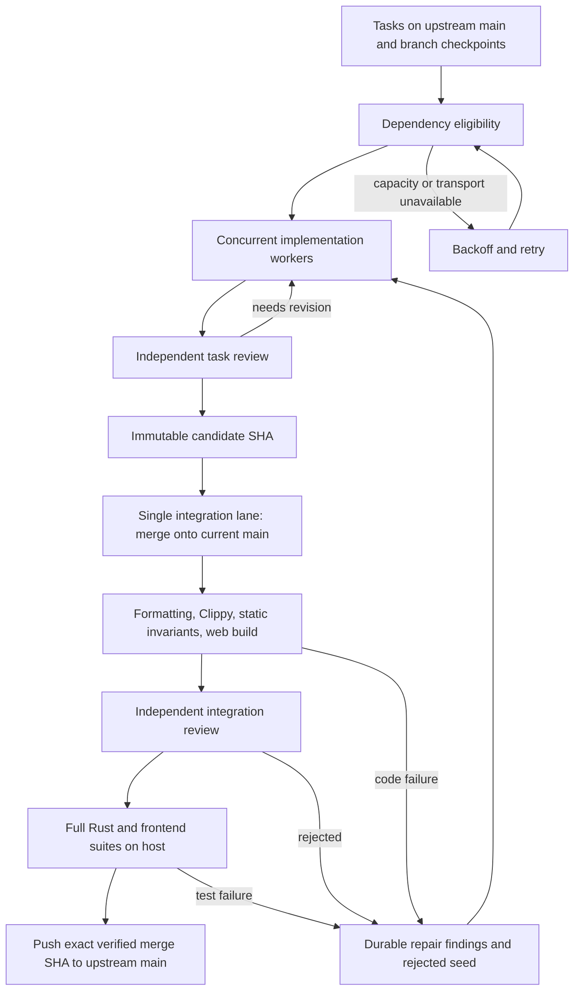

# Development loop audit

2026-10-08. Scope: the development controller, sandbox driver, remote worker,
agent rounds and prompts, deterministic checks, host test gate, promotion,
cockpit reporting, and their local regression tests. This audits the shell
and Python development machinery, not Gyre's Rust product runtime.

## Verdict

The basic shape is reasonable: a durable task ledger, independent implementation
workers, immutable candidate commits, independent review, and promotion of an
exact checked merge. It can ship upstream commits. The previous failure path,
however, was not a convergent implementation loop: a failed checker stopped
the task, and an explicit retry could check the same broken commit again.
Increasing slots amplified wasted work without fixing that feedback gap.

The follow-up implements requirement generations, durable launch recovery,
owned resource inventory, asynchronous cleanup, baseline classification,
backpressure and bounded fidelity discovery. These paths have local regression
coverage. Their cloud behavior and model judgment still need live validation.
Compilation, lint, tests, and agent review provide evidence; none alone proves
spec fidelity.

The controller should remain small. A new orchestration framework is not
needed to repair these issues. Strengthen its state and execution contracts,
then measure successful upstream delivery before expanding the abstraction.

## What actually runs



`dev-controller.py` imports upstream tasks into SQLite WAL, orders eligible
tasks, and launches `dev-sandbox.sh`. The driver creates and stages an
OpenShell sandbox. `dev-remote.sh` clones or resumes a checkout and runs up
to six agent rounds, checkpointing and pushing after each round. Clone and
transport retries reuse the sandbox. Implementation and review use separate
OMP sessions; all roles currently pin GLM 5.3.

A checker creates a two-parent merge onto an explicit base, runs
`dev-check.sh`, and requests a separate integration review. Its verified ref
identifies the merge commit. The controller validates the base and candidate
ancestry, runs the full Rust and frontend suites on that exact tree locally,
and pushes that SHA to `main` without force. A moving upstream base causes
rechecking. The merge message includes the task, spec, candidate, and shipped
behavior from the task file (`dev-merge-message.py`).

The host test lane matters: the current sandbox environment cannot run tests
requiring loopback listeners. Clippy compiles all Rust targets in the cloud;
the actual full suites run on the host before promotion. This host is a
delivery dependency and a throughput bottleneck.

## Evidence from the running ledger

At one read-only observation during this audit, the ledger contained:

| State | Tasks |
|---|---:|
| Running | 42 |
| Candidate | 1 |
| Failed | 3 |
| Ready | 98 |
| Marked merged | 65 |

Only **one** `merged <SHA>` event was recorded by this controller. The 65
figure includes tasks imported as already complete on upstream `main`.
It is not evidence of 65 controller deliveries. The three latest failed
checkers were task-072, task-093, and task-097, all with exit 1. These are
gate failures, not just provisioning failures. The previously inspected
task-072 log contained concrete Clippy findings, including `unnecessary_map_or`
and `double_must_use`; those findings were not routed back to implementation.

All 209 ledger tasks referenced existing dependency tasks at this observation.
That does not establish an acyclic graph or correct dependency decomposition.
The parser also truncated multiline dependency lists to their first item:
30 task files have affected lists, including task-114's dependency on task-208.
This permitted premature implementation even when omitted prerequisites were
unfinished. The repair restores every listed dependency on the next sync.
A separate scan using the repaired parser found 163 dependency edges and no
cycles across the 209 local task files.
The coverage summary was last updated October 5 and reported 46% coverage.
Coverage is maintained Markdown; a task merge does not mechanically establish
that a section's claimed status is true or refresh the coverage audit.

These are point-in-time observations of a running system. No live task or
sandbox was changed as part of this audit, and no new live merge was verified.

## Findings and focused repairs

### Multiline dependencies were silently discarded — critical, repaired

`field()` used `\s*` after the field name. That consumed the newline after
`depends_on:` and returned the first list item as a scalar. `deps()` therefore
never read the rest of the list. Scheduling's set-containment check was
correct for the truncated data, but incorrect for the task's actual contract.

Scalar parsing now consumes horizontal whitespace only, and the list parser
reads all dependency items. A Git-backed scheduling test proves that merging
the first prerequisite does not admit a task whose second prerequisite remains
unfinished. Promotion also rechecks dependencies, so an old in-flight checker
cannot bypass the repaired scheduler; it releases the integration lane for
its unfinished prerequisites. This explains part of why high worker activity could coexist with
poor integration results. It does not establish the cause of every failure.

### 1. Failed verification did not drive implementation — critical, repaired

Previously, `reap()` moved any failed checker to `failed`. A host suite failure
did the same in `promote()`. `retry_failed_task()` selected a completed seed as
a candidate, so pressing Retry could rerun verification without editing code.

Code failures now create a durable `repair.md` containing the candidate/base
SHAs, attempt ID, and the last 64 KiB of the failure log. The rejected candidate
becomes the next worker's seed. Its task is reopened as `needs-revision`, and
both implementation and review receive the findings. Sync cannot rediscover
the rejected legacy candidate and bypass repair. Three repair cycles are
allowed; repeated failures then require attention. An explicit retry retains
the findings and grants a fresh budget.

Startup migrates identifiable old checker and host-suite failures into this
path. Unknown driver exits, missing host processes, configuration errors,
and exhausted bootstrap/push retries are not automatically treated as code
defects. Model timeouts and other operational outcomes still need better
typed classification; the repair loop is not a universal retry policy.

### 2. Concurrent final checks invalidated each other — high, repaired

Previously, many checkers could build against the same `main` base. The first
merge advanced main, invalidating the other integrations and requiring new
sandboxes and repeated full verification. Workers could also occupy every
slot while ready candidates waited.

Implementation remains concurrent. Final integration is now one lane,
including the host gate and upstream promotion. Candidates have priority,
and one admitted slot is reserved for integration when capacity exceeds one.
Older in-flight host gates also prevent starting another host gate. One slot
alternates between implementation and integration.

This improves useful throughput but does not remove the serial bottleneck.
Fifty desired slots permit up to 49 implementation workers plus integration;
they do not permit 50 independent safe promotions onto one moving main branch.
A future speculative merge queue needs a validated chain of bases, not
independent checks against the same base.

### 3. A candidate could weaken the verifier judging it — high, partially repaired

Formatting and Clippy helpers were staged by the driver, but most static
checks ran from the candidate's checkout. Changing a check to always pass,
or changing its exemptions, could weaken the gate.

Integration now runs upstream static scripts against candidate code, restores
the candidate scripts, then runs those too. Script locations are preserved
because some checks derive the repository root from their location. New
exemption entries are rejected by identity, including replacements that keep
the entry count unchanged. Restoration is trapped on failure so the reviewer
sees the original merge tree.

This protects existing static gates from accidental weakening. It does not
make the entire build or test system independent of the candidate: build
configuration, test bodies, fixture behavior, and product code remain editable.
The independent reviewer must reject meaningless tests and omitted behavior.
Agent sandbox access is broad; this is not a security boundary against a
deliberately hostile agent.

### 4. Completion could bypass a successful task review — high, repaired in new workers

The worker previously stopped on `progress: complete`, regardless of the
round's exit code or which role set it. A failed implementation round could
leave that frontmatter behind and be nominated as a candidate.

New workers require a successful review round before honoring completion.
Completed seeds receive a fresh review; rejected seeds return to implementation.
This is workflow evidence, not a cryptographic attestation or independent proof
of correctness. Imported old candidates still undergo integration review and
the full verification pipeline.

### 5. Source outages could strand outcomes and suppress cleanup — high, repaired

The controller marked a worker attempt finished before fetching its checkpoint.
If that fetch failed, the task could remain running with no running attempt
left to consume. A failed sync also skipped the cleanup pass altogether.

Checkpoint refresh now happens before consuming the worker outcome. Cleanup
and host-process observation run independently of source sync. A durable exit
record makes a sandbox eligible for cleanup even if its Git outcome cannot
yet be consumed. Failed upstream pushes retain the verified merge instead
of automatically spending another checker sandbox on an unchanged tree.
An invalid verified ref blocks its task rather than killing the entire controller.

### 6. Cockpit counters confused imported state with delivery — high, repaired reporting

The cockpit now distinguishes upstream-complete tasks from recorded controller
shipments, and shows when integration findings are awaiting repair. Provider
availability, Ready observations, and slot admission describe infrastructure;
they do not prove code quality or convergence. The coverage display remains
prominent, but its input is the repository's coverage claims.

## Follow-up implementation

| Audit finding | Implemented behavior |
|---|---|
| Changed requirements | Hash task requirements, referenced specs and GOAL; retain desired/observed/candidate generations; reopen stale completion and reject stale candidates. Progress, commit attribution and shipped summaries do not change the requirement generation. |
| Discovery and fidelity | Once runnable implementation work drains, propose at most two scoped audit tasks, four sections each. Independently review actual production entry points and replay acceptance probes. Correct hollow coverage claims and reopen or create implementation tasks. Audit completion is counted separately from product delivery. |
| Crash windows | Commit launch intent before starting worker, checker, host or gateway processes. Publish PID/start-time/boot identity before child cloud operations; adopt launches on restart; fail closed on uncertain identity. |
| Resource accounting | Reconcile a complete owned gateway inventory. Charge running/provisioning objects, launch reservations, orphans and deletion debt. A successful delete request frees no slot until inventory confirms absence. Stale or incomplete inventory pauses admission. |
| Slow cleanup/authentication | Run at most four durable deletion jobs asynchronously, with bounded authentication locks, CLI deadlines and exponential retry. Git source outages do not stop cleanup. |
| Autoscaler delays | If create times out but the named sandbox exists, keep polling the same object with increasing delay, an overall deadline and visible Pending phase. Clone, staging and push retry inside that object. |
| Broken main/environment | Reproduce a failed cloud gate on the main base in the same sandbox; run the same full host suites on the checked main base when a candidate fails. Cache by main SHA, environment and tool versions. A proven baseline defect proposes one scoped prerequisite task. Host infrastructure outages retry the verified tree locally with backoff; they consume no code-repair budget or new sandbox. |
| Integration backlog | Reserve integration capacity, serialize integration, cap candidate backlog (default eight), and report deliveries/hour, queue age, gate success and automatic repairs. |
| Mutable driver bundle | Freeze and hash scripts, prompts, model configuration and policy at launch. Persist the pinned model/image and bundle digest with the attempt. |
| Dependencies/write conflicts | Diagnose missing dependencies and cycles. Auditor scopes lease their matrix and referenced task files; reserve new task IDs durably. Ordinary production work remains concurrent, with conflict detection/rebase at integration. |
| Reporting | Show remote resource charge, deletion debt, inventory errors, attempt phases, observed generation, blocked baseline repairs and reviewable PRs in the cockpit. |
| Evidence/compaction | Keep bounded repair findings and per-generation fidelity JSON records with real production entry points and replayable probes. Prompts explain the contract; scripts enforce record shape, scope and probe outcomes. |

Publication now creates an idempotent GitHub PR for the verified integration
ref **after** independent cloud review and host suites pass. Its body describes
shipped behavior, exact head/base SHAs, gate results and the frozen bundle.
GitHub must confirm the exact head and expected base before publication is
accepted. Default mode then pushes that exact merge to main. `--publication pr`
leaves the verified PR open; returning to default mode resumes promotion with
the normal base/generation checks. Publication failures retain the verification
and back off. PR URLs are immediately available in the cockpit ledger.

### Practical limits still requiring observation

- Live end-to-end delivery is being verified. The original restricted session
  prepared a commit bundle; Git write and network access are now available.
- The installed CLI confirms labels, JSON output and pagination options.
  The live gateway returned a complete 57-object inventory. TLS diagnostics
  precede its JSON on stdout; the parser now handles that prefix while rejecting
  malformed or truncated documents. Deletion acknowledgement/absence and full
  delivery recovery still require live observation. Unknown or apparently
  truncated inventory fails closed.
- Ownership labels identify new orphans. Unlabelled old sandboxes absent from
  the ledger need explicit ownership confirmation before removal. Cleanup
  cannot complete during a gateway outage; the cockpit reports the debt.
- Fidelity judgments remain model judgments. Mechanical evidence gates reject
  missing or failing probes, but they cannot establish that an assertion proves
  every semantic requirement. Follow-up tasks undergo independent review and
  the ordinary integration gates.
- Resource leases cover metadata auditors' demonstrated shared files. Normal
  implementation write sets are discovered through Git integration; speculative
  parallel merge lanes are deliberately not introduced.

## Quality and convergence contract

A delivered task should identify its desired spec/task generation, production
diff, reviewed acceptance evidence, gate outcomes, and upstream merge SHA.
Distinguish these results in state:

- Infrastructure unavailable: wait and retry with backoff, without spending a
  code repair budget.
- Candidate defect: preserve the candidate, send concrete findings to repair,
  and independently re-review changed code.
- Main baseline defect: block promotion and schedule a scoped prerequisite fix.
- Upstream push unavailable: preserve the verified merge and retry publication,
  checking whether the prior push actually succeeded.
- Delivered: upstream contains the verified tree; the corresponding spec
  generation has been observed and its acceptance evidence retained.

Meaningful operating metrics are deliveries/hour, candidate-to-merge latency,
first-pass gate success, repair convergence, stale-candidate age, time spent
waiting for dependencies/infra, and deletion-pending sandbox count. Agent
activity, successful provisioning, task completion claims, and coverage
percentage are not substitutes for these measurements.

## Validation and deployment

The local Python suite exercises controller restart outcomes, capacity
backoff, provider gating, candidate repair and budgets, integration
serialization, exact merge publication to a bare Git upstream, host gate
failure, sandbox recovery/deletion, provider configuration, and merge messages.
New gate tests execute the actual runner and show that weakening an upstream
check or replacing a frozen exemption cannot produce a passing integration.
These tests are included in CI, along with the stream relay test. Follow-up
fixtures cover generations, launch intent, ownership inventory, deletion debt,
retained pending sandboxes, baseline classification, bounded auditing, evidence
validation, candidate backpressure and idempotent PR publication.

Local results: 72 Python tests passed; shell syntax, cockpit JavaScript syntax,
and `git diff --check` passed. The Node relay test now passes with network/filesystem restrictions removed,
including text, incremental tool output, prompt/thinking omission and verdict
assertions. The earlier restricted session had rejected nested Node execution
with `EPERM`.
CI execution itself has not been observed from this shell.

Normal commit hooks also ran. `response-consumption` and `dead-components`
failed on untouched Rust CLI/server and product Svelte files. Both checks were
rerun on an isolated checkout of the unchanged base `51636f238873d7bbce317ac7a78a3642ed52c237`
and failed there too. The isolated tooling commit skips only these two confirmed
baseline hook failures; it does not change their scripts, exemptions, CI or
feature delivery gates. All other applicable commit hooks pass. These baseline
product defects are not repaired by this tooling change.

The Git delivery fixture supplies deterministic checker and host outcomes.
The GitHub API fixture is also synthetic. These fixtures prove local orchestration
and exact-SHA publication, not model competence,
production behavior, or remote gateway operation. A live acceptance run still
needs a real task, real model calls, real sandbox checks and host suites, and
confirmation that GitHub contains the merge and its shipped description.

Changes in this audit are local working-tree changes. Running controllers
and already staged sandboxes do not automatically reload them. Preserve the
ledger and let existing attempt processes be adopted on restart:

```bash
source .gyre-dev-controller/gateway.env
pkill -TERM -f '[d]ev-controller\.py run'
uv run python scripts/dev-controller.py run --slots 50 --launch-burst 4
```

The existing slots file remains authoritative. Set it to `0` before a restart
if you want to observe recovery without dispatching new workers. Restore the
desired slot count after inspecting the ledger. Do not remove the ledger,
checkpoint refs, or attempt logs to resolve a controller lock error.
